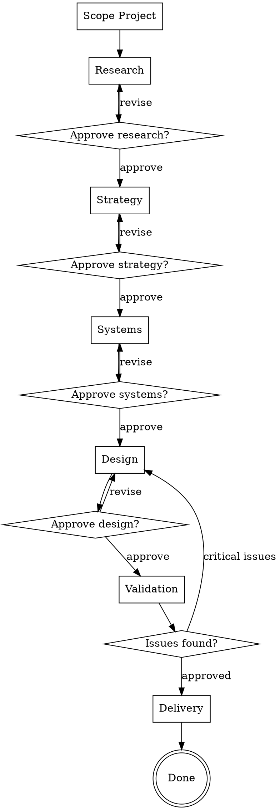

# Design Pipeline

A guided workflow for taking a design project from research through delivery. This skill orchestrates individual design skills into a coherent pipeline with quality gates between phases.

<HARD-GATE>
Do NOT skip phases without explicit user approval. Present phase outputs and get confirmation before proceeding to the next phase. The user may choose to skip phases, but that must be their decision.
</HARD-GATE>

## When to Use

- Starting a new product or feature from scratch
- The user wants a structured end-to-end design process
- You need to ensure thorough coverage of design concerns

Do NOT use when:
- The user wants a specific, focused task (use individual skills)
- The user is entering mid-process (start at the appropriate phase)

## Checklist

You MUST create a todo for each phase and complete them in order:

1. **Scope the project** — Understand what's being designed, for whom, and constraints
2. **Research Phase** — Understand users and context
3. **Strategy Phase** — Frame the problem and define direction
4. **Systems Phase** — Establish design foundations
5. **Design Phase** — Design screens, interactions, and flows
6. **Validation Phase** — Test and validate decisions
7. **Delivery Phase** — Hand off and document

## Process Flow

## Phase 0: Scope the Project

Before entering the pipeline, understand the project:

1. **What** is being designed? (Product, feature, redesign?)
2. **Who** are the users? (Any existing research?)
3. **Why** now? (Business driver, user pain, opportunity?)
4. **Constraints** — timeline, technology, brand, accessibility requirements
5. **Existing assets** — any research, designs, systems already in place?

Based on the answers, determine which phases to include. A project with existing research may skip Phase 1. A project with an established design system may skip Phase 3.

**Gate:** Confirm the pipeline scope with the user before proceeding.

---

## Phase 1: Research

**Goal:** Understand who you're designing for and what their experience looks like today.

Load and execute these skills in sequence:
1. `user-persona` — Create 2-4 personas from available data
2. `empathy-map` — Build empathy maps for the primary persona
3. `journey-map` — Map the end-to-end journey for the primary persona

**If research data is sparse:**
- Use `interview-script` to prepare scripts for gathering data
- Use `jobs-to-be-done` to map user motivations from available information

**Gate:** Present a research summary with:
- Key personas (prioritized)
- Primary empathy map
- Journey map with pain points highlighted
- Top 3-5 design implications

Get user approval before proceeding to Strategy.

---

## Phase 2: Strategy

**Goal:** Frame the problem, understand the landscape, and define direction.

Load and execute these skills in sequence:
1. `competitive-analysis` — Analyze 3-5 competitor approaches
2. `north-star-vision` — Articulate the product vision
3. `design-principles` — Define 4-6 guiding principles
4. `opportunity-framework` — Identify and prioritize opportunities
5. `metrics-definition` — Define 3-5 success measures
6. `design-brief` — Consolidate into a brief

**Gate:** Present the strategy document with:
- Competitive landscape summary
- North-star vision statement
- Design principles
- Prioritized opportunity list
- Success metrics
- Design brief

Get user approval before proceeding to Systems.

---

## Phase 3: Systems

**Goal:** Establish the design foundations — tokens, naming, core components.

Load and execute these skills in sequence:
1. `design-token` — Define the token system (color, spacing, typography, elevation)
2. `naming-convention` — Establish naming rules for tokens and components
3. `component-spec` — Spec the core components needed for the project

**If building on an existing system:**
- Use `design-token-audit` to assess current token coverage
- Use `accessibility-audit` to check existing components

**Gate:** Present the systems foundation with:
- Token system overview (categories, tiers, naming)
- Core component list with specs
- Naming convention rules

Get user approval before proceeding to Design.

---

## Phase 4: Design

**Goal:** Design the actual screens, interactions, and flows.

Load and execute skills based on what the project needs:

**Visual Design:**
1. `layout-grid` — Define the grid system
2. `visual-hierarchy` — Establish hierarchy for key screens
3. `typography-scale` — Apply the type system
4. `color-system` — Apply the color system
5. `spacing-system` — Apply spacing rules
6. `responsive-design` — Define responsive behavior
7. `dark-mode-design` — If applicable

**Interaction Design:**
8. `state-machine` — Model complex component interactions
9. `micro-interaction-spec` — Specify key micro-interactions
10. `feedback-patterns` — Define system feedback
11. `error-handling-ux` — Design error handling
12. `loading-states` — Design loading patterns

Not every skill is needed for every project. Use judgment based on the project scope.

**Gate:** Present the design specifications with:
- Key screen layouts with annotations
- Responsive behavior summary
- Interaction specifications for complex components
- Error handling approach

Get user approval before proceeding to Validation.

---

## Phase 5: Validation

**Goal:** Test and validate design decisions before delivery.

Load and execute these skills:
1. `heuristic-evaluation` — Expert review against Nielsen's 10 heuristics
2. `accessibility-audit` — WCAG 2.2 AA compliance check

**If user testing is planned:**
3. `usability-test-plan` — Design the test plan
4. `test-scenario` — Write specific test tasks

**Gate:** Present validation findings with:
- Heuristic evaluation results (issues by severity)
- Accessibility compliance status
- Remediation recommendations

If **critical issues** are found, return to Phase 4 to address them before proceeding.
If **minor issues** are found, document them for the delivery phase.
Get user approval before proceeding to Delivery.

---

## Phase 6: Delivery

**Goal:** Package the design for implementation.

Load and execute these skills:
1. `handoff-spec` — Create developer handoff specifications
2. `design-qa-checklist` — Create implementation QA checklist
3. `design-rationale` — Document key design decisions

**Output:** Complete handoff package with:
- Visual and interaction specifications
- Asset list
- QA checklist
- Design rationale document
- Known issues from validation (with severity)

---

## Key Principles

- **Gates are mandatory** — Do not proceed without user approval at each gate
- **Phases can be skipped** — If the user says "skip research," respect it
- **Iteration is expected** — Validation findings often send you back to Design
- **Each phase builds on the previous** — Reference earlier outputs, don't repeat work
- **Track progress** — Use TodoWrite to track phase and step completion
- **Stay focused** — Not every skill is needed for every project; use judgment
- **Suggest but don't force** — The pipeline is a guide, not a prison
